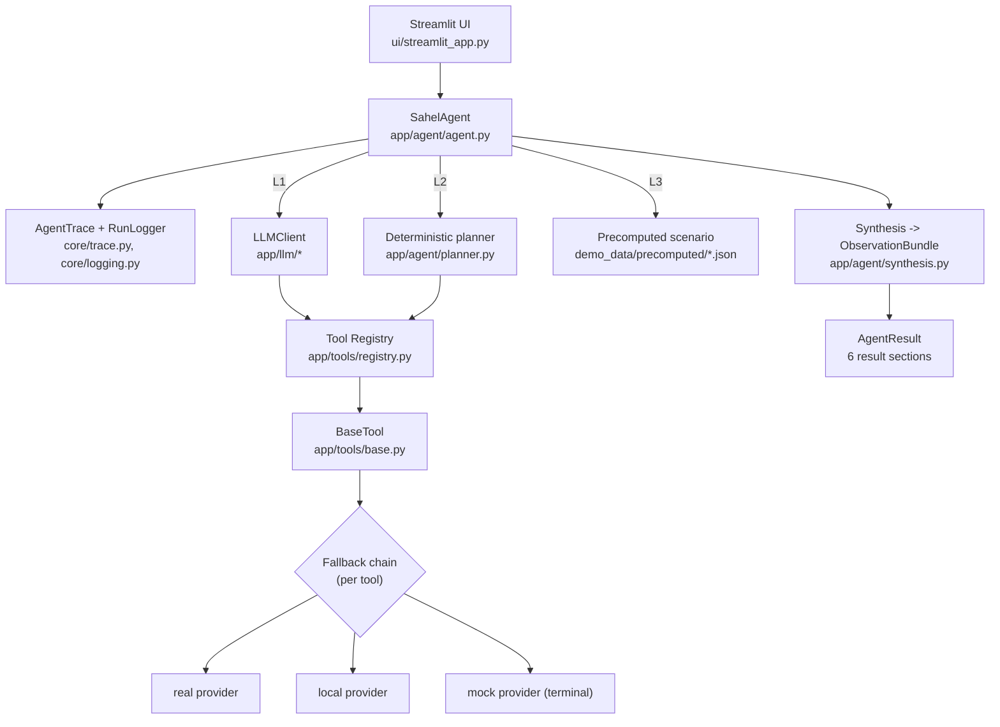
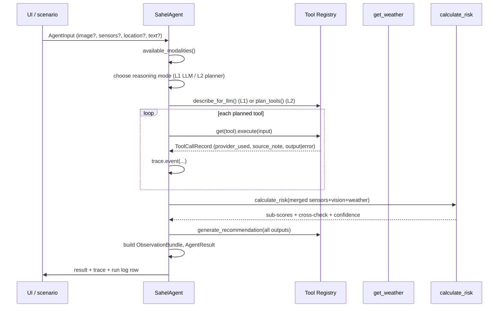
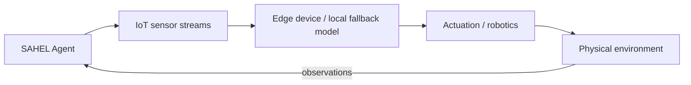

# Architecture

## 1. Principles

- **One well-designed agent**, not a multi-agent constellation.
- **The agent never imports an SDK.** It talks to the Tool Registry; tools talk to
  providers; providers wrap external services.
- **Every capability is honestly tagged:** `IMPLEMENTED / MOCKED / INTEGRATION_READY / FUTURE`.
- **Working demo > architecture.** Offline-first, `$0`, no key required.
- **BUILD ONCE. CONNECT LATER.** Hackathon day = configuration, not development.

## 2. Component map

## 3. Data flow (one analysis)

## 4. Agent loop (3 levels)

| Level | Trigger | Mechanism | Honesty label |
|---|---|---|---|
| **L1** | real LLM configured **and** not offline | `LLMClient.complete_with_tools()` picks tools; bounded re-ask after results | LLM tool-calling |
| **L2** | mock LLM / offline / L1 schema failure | `planner.plan_tools()` selects tools from present modalities | rule-based |
| **L3** | reasoning path raised **and** `scenario_id` set | load frozen `demo_data/precomputed/<id>.json` | precomputed |

If L1/L2 raise and there is no precomputed scenario, the agent retries once with
the deterministic planner and returns a `degraded=True` result with whatever it has.

The synthesis backbone (`calculate_risk`, `generate_recommendation`) always runs,
even if L1 forgot to request it.

## 5. Tool calling contract

`BaseTool.execute(raw_input) -> ToolCallRecord` (never raises for provider errors):

1. `validate_input` against the tool's Pydantic input schema (`ToolInputError` on fail).
2. Walk the ordered provider list; first success wins.
3. `validate_output` each provider result against the output schema.
4. On `NotIntegratedError` / `ProviderError` / `ToolOutputError` / any exception →
   try the next provider.
5. Record `provider_used`, `source_note` ("used 'local' after open_meteo failed"),
   `duration_ms`, and `output` **or** `error`.

## 6. Fallback / DEMO_MODE

- `Settings.offline_first` = `demo_mode or environment == "demo"`.
- Real providers (`open_meteo`, `llm_vision`, `llm` recommendation) **self-skip**
  when `offline_first`, raising `ProviderUnavailable` so the chain proceeds.
- Every tool guarantees a terminal `IMPLEMENTED`/`MOCKED` provider
  (`mock` weather, `local_heuristic`+`mock` vision, `template` recommendation,
  `rules`/`heuristic` for sensors/risk).

## 7. Observability

- `AgentTrace`: ordered `TraceEvent`s + `ToolCallRecord`s (shown in "Run details").
- `RunLogger`: one JSON row per run → `logs/runs.jsonl` **and** SQLite `runs` table
  (`app/data/database.py`). Feeds the benchmark and the UI history.

## 8. Future architecture

Everything left of "IoT sensor streams" exists today as an interface
(`get_sensor_data`, `analyze_location`, `get_satellite_data`, `speech_to_text`);
nothing to its right is implemented. See [`roadmap.md`](roadmap.md).
